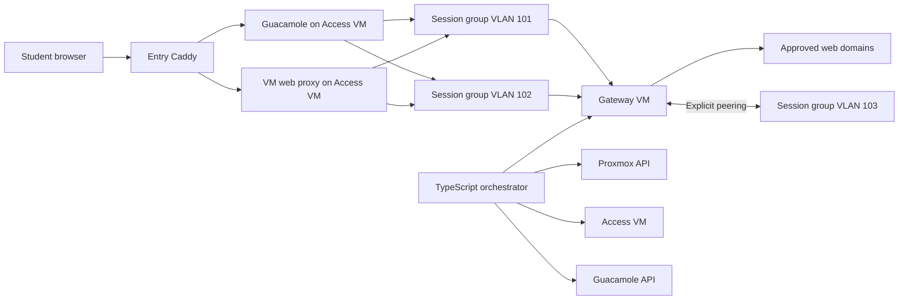

# Student Lab VM Network Architecture and Implementation Plan

## Status

Implementation in progress. Reusable lab profiles, profile/template membership,
profile-first instance launch, persistent `planned` network groups, readiness,
and deterministic desired-state projection are in place. VLAN transport and the
persistent SDN zone have passed their infrastructure acceptance gates. Access
VLAN 2000 is committed, and the backend now performs serialized, read-only VNet
and Access reconciliation. The Gateway base is provisioned but deliberately
stopped and has no uplink; guest policy application and active backend mutation
remain deferred until their safety gates pass.

## Context

The TypeScript/Node.js backend provisions student lab VMs on Proxmox by cloning
registered templates. Students access those VMs through Apache Guacamole for RDP
or SSH, or through the existing Caddy-based web UI proxy.

Lab VMs currently share the flat, isolated `vmbr20` network. This design replaces
that flat network with isolated VLAN-backed Proxmox SDN VNets. It adds controlled
web access, configurable routing between lab groups, and infrastructure access to
all groups without exposing one student's environment to another.

## Goals

1. Isolate each lab session or cohort in its own virtual network group.
2. Reuse network policy defined by independent lab profiles while allocating
  separate networks to separate owners or future sessions.
3. Allow each profile to define a list of websites its VMs may access.
4. Support HTTP and HTTPS use cases such as Linux package updates and downloading
   approved malware-removal tools.
5. Allow selected groups to communicate with selected other groups.
6. Allow Guacamole and the VM web proxy to reach every provisioned VM.
7. Prevent the Access VM from becoming an alternate router around policy.
8. Create, update, reconcile, and remove dynamic resources through the existing
   orchestrator rather than requiring per-group work in the Proxmox UI.

## Non-Goals and Limitations

- Domain rules provide approved **web access**, not arbitrary access to every
  protocol associated with a domain. Traffic such as Git over SSH on TCP 22 is
  denied unless a separate policy is introduced later.
- HTTPS filtering relies on the TLS Server Name Indication (SNI) visible to the
  gateway. Connections without an allowed, visible SNI fail closed.
- HTTPS interception does not decrypt or inspect application data. Squid uses
  splice mode, so no custom CA certificate is installed on lab VMs.
- UDP 443 is blocked so clients fall back from QUIC/HTTP/3 to filterable HTTPS over
  TCP.
- Encrypted Client Hello traffic that hides the destination hostname is denied.
- Preventing every possible DNS-over-HTTPS tunnel is outside the initial scope.
  Known public resolvers should not be allowlisted, and external DNS transports
  are blocked where identifiable.
- The initial implementation targets the existing single Proxmox node. Cluster
  placement and trunk availability on multiple nodes require additional design.

## Architecture Overview



## Components

### Dedicated Proxmox Lab Bridge

`vmbr20` remains the dedicated lab bridge. It must be VLAN-aware and should not
have a physical bridge port. Lab VLAN traffic therefore remains inside the
Proxmox host unless deliberately routed by the Gateway VM.

The Proxmox management network and the Gateway VM's internet/uplink network stay
separate from `vmbr20`.

### Proxmox SDN Zone and VNets

A one-time VLAN SDN zone named `labzone` is created on `vmbr20`.

Each active network group has:

- one VLAN tag;
- one Proxmox SDN VNet;
- one IPv4 subnet;
- one Gateway VM address in that subnet;
- one Access VM address in that subnet; and
- zero or more student VMs.

Lab profiles own reusable policy and may include many templates; a template may
belong to many profiles. The current group identity is one group per owner/profile,
which supports deliberate multi-VM labs without making policy template-specific.
A future formal session/cohort entity may replace the owner component of that
identity without changing profile ownership of policy.

### Gateway VM

The Gateway VM has:

- a management NIC used by the orchestrator;
- an uplink NIC used for approved internet egress; and
- a trunk NIC attached to VLAN-aware `vmbr20`.

It runs:

- VLAN interface reconciliation;
- `dnsmasq` for DHCP and controlled DNS;
- Squid for HTTP/HTTPS destination filtering;
- nftables for routing, NAT, proxy redirection, DNS enforcement, and peering.

It is the only permitted path from a lab VLAN to another VLAN or the internet.

### Access VM

The Access VM hosts the existing Guacamole and `vm-web-proxy` containers. It has:

- a management NIC used by Entry Caddy and the orchestrator; and
- a trunk NIC attached to VLAN-aware `vmbr20`.

The host receives an address in every active lab VLAN. Docker containers reach
lab VMs through the host routing table and Docker's existing source NAT behavior.
No Docker network is created for every lab VLAN.

The Access VM is not a general router. Its firewall only allows container-originated
traffic to lab VLANs and related return traffic. It explicitly drops forwarding
from one lab VLAN to another and from lab VLANs toward management networks.

Guacamole and the web proxy ports are bound to the management address where
possible. Host firewall rules additionally restrict `8080/tcp` and `9443/tcp` to
the expected Entry Caddy/backend source addresses. Lab VMs must never be able to
connect directly to the dynamic web proxy and supply their own `X-Target-Host`.

Traffic-backed observation on 2026-08-07 confirmed that both Access service
ports receive their Entry-side connections from API LXC `10.10.10.100`: Guacamole
on `8080/tcp` and the web proxy on `9443/tcp`. On the same date, Linux `nft -c`
accepted the generated VLAN 2000 ruleset for revision
`dd6b276b38dde763f9650cab83bb055ea2cefd0d03f472c964e7884b1a51a5e0`. Live
transaction `access-20260807T095309Z-dd6b276b38dd` then passed VLAN transport,
API-to-service, Docker-to-VLAN, and VLAN-origin service-denial checks and was
committed. The legacy `10.10.20.10/24` address remains during the migration.

### Entry Caddy

The existing Entry Caddy remains on the management network. It:

- authenticates the student's request;
- asks the backend to authorize access and resolve the selected VM;
- copies `X-Target-Host` and `X-Target-Proto` from the backend response; and
- forwards the request to the Access VM's web proxy.

The final-hop web proxy continues stripping the orchestrator's `token` and
`webTargetMachine` cookies before forwarding to student-controlled VM services.

### TypeScript Orchestrator

The backend owns desired state for:

- VLAN and subnet allocation;
- SDN VNets;
- VM network attachment;
- Gateway and Access VM trunk allowlists;
- Gateway and Access VM VLAN interfaces;
- DHCP and DNS scopes;
- Squid domain ACLs;
- nftables peering and egress policy;
- Proxmox VM firewall rules; and
- Guacamole connection permissions.

Reconciliation is idempotent and based on full desired state. The database is the
source of truth; scripts must not accumulate imperative edits over time.

## Traffic Policy

### Same-Group Traffic

Traffic between VMs in the same group is switched directly at layer 2 and does
not traverse the Gateway VM. Proxmox firewall rules are therefore required on
every student VM.

The default policy denies traffic from other student VM addresses. Required
same-group lab traffic must be explicitly enabled by the group's policy. RDP,
SSH, and configured VM web ports are allowed only from the Access VM's address in
that VLAN.

This also limits common same-segment attacks such as unauthorized DHCP service,
ARP-based lateral access, and direct RDP between student VMs. Where Proxmox
firewall cannot enforce a required layer-2 control, the design must be tested and
strengthened before treating same-group VMs as mutually hostile.

### Group Peering

Peering is deny-by-default. An undirected database peering produces two nftables
entries:

```text
vlan101 -> vlan102
vlan102 -> vlan101
```

Both directions are necessary because `ct state established,related` only allows
reply traffic; it does not permit new connections initiated in the reverse
direction.

The first implementation permits all routed IP traffic between explicitly peered
groups. Protocol- and port-specific peering can be added to the data model later.
Same-group Proxmox firewall policy must not accidentally block traffic required by
a multi-VM lab.

### Approved Web Egress

Squid enforces domain allowlists per source subnet:

- HTTP uses the request destination/Host header.
- HTTPS uses SNI and `ssl_bump` in peek-and-splice mode without TLS decryption.
- ACLs accept an exact domain and, when configured, its subdomains.
- Requests not matching the group's allowlist are denied.

Domain entries must have explicit semantics. Store normalized lower-case domains
without schemes, paths, ports, or trailing dots. A separate `include_subdomains`
flag avoids ambiguous wildcard strings.

Package repositories and download sites often redirect to CDN, mirror, API, or
object-storage hosts. Each profile's allowlist must include the complete tested
host set needed for its workflow. For Linux updates, prefer a controlled internal
package mirror when practical; it is more predictable than maintaining a broad
public CDN allowlist.

Gateway nftables policy must:

- redirect lab TCP 80 and 443 to Squid;
- block direct forwarded TCP 80 and 443 that bypasses Squid;
- block UDP 443;
- allow DNS only to the Gateway VM resolver;
- block external TCP/UDP 53 and TCP 853;
- deny all other lab-to-uplink forwarding by default;
- allow established and related return traffic; and
- apply source NAT only to traffic emitted by Squid, the controlled resolver, or
  another explicitly approved gateway service.

The implementation must ensure redirected traffic cannot recursively re-enter
the proxy rules and that direct-IP HTTPS without an allowed SNI fails closed.

### DNS

`dnsmasq` provides one DHCP scope per active VLAN and advertises the Gateway VM's
per-VLAN address as both default gateway and DNS server.

The Gateway resolver uses trusted upstream resolvers through its uplink. Lab VMs
cannot contact arbitrary DNS servers directly. DNS filtering alone is not treated
as the web security boundary; Squid still evaluates the HTTP destination or SNI.

### Access Infrastructure

The Access VM may initiate connections into every lab subnet. Lab VMs may return
traffic for those connections but may not initiate connections to Access VM
management services or use the Access VM as a router.

The Gateway and Access per-VLAN addresses should be stable and reserved, for
example `.1` and `.2`. DHCP leases begin after the reserved infrastructure range.

## Proxmox Trunk Reconciliation

Creating `eth0.<tag>` inside a VM does not by itself pass tagged traffic. The
orchestrator must reconcile both sides of each trunk:

1. Update the Gateway and Access Proxmox NIC configuration with the complete
   active `trunks=<tag-list>` value.
2. Push the complete active VLAN/subnet/address list to each VM.
3. Run each VM's idempotent VLAN reconciliation script.
4. Remove stale guest interfaces only after no network group depends on them.

The trunk list should include only active lab VLANs. An unrestricted trunk is not
used because it increases the blast radius of a compromised infrastructure VM.

Changes that require a virtual NIC restart must be scheduled safely. The
implementation should first test whether Proxmox can hot-apply trunk-list changes
for the selected virtual NIC and guest configuration.

## Data Model

The implemented foundation is:

```sql
CREATE TABLE lab_profiles (
    id              INT GENERATED ALWAYS AS IDENTITY PRIMARY KEY,
  name            VARCHAR(255) NOT NULL UNIQUE,
  description     TEXT,
  allow_same_group BOOLEAN NOT NULL DEFAULT TRUE,
  is_default      BOOLEAN NOT NULL DEFAULT FALSE,
    created_at      TIMESTAMPTZ NOT NULL DEFAULT CURRENT_TIMESTAMP,
    updated_at      TIMESTAMPTZ NOT NULL DEFAULT CURRENT_TIMESTAMP
);

CREATE TABLE lab_profile_templates (
  profile_id  INT NOT NULL REFERENCES lab_profiles(id) ON DELETE CASCADE,
  template_id INT NOT NULL REFERENCES templates(id) ON DELETE CASCADE,
  PRIMARY KEY (profile_id, template_id)
);

CREATE TABLE allowed_web_domains (
  profile_id         INT NOT NULL REFERENCES lab_profiles(id) ON DELETE CASCADE,
    domain             TEXT NOT NULL,
    include_subdomains BOOLEAN NOT NULL DEFAULT TRUE,
  PRIMARY KEY (profile_id, domain)
);

CREATE TABLE network_groups (
    id            INT GENERATED ALWAYS AS IDENTITY PRIMARY KEY,
  owner_id      VARCHAR(255) NOT NULL REFERENCES users(vu_id),
  profile_id    INT NOT NULL REFERENCES lab_profiles(id),
  vlan_tag      INT UNIQUE,
  vnet_name     TEXT UNIQUE,
  subnet_cidr   CIDR UNIQUE,
  state         TEXT NOT NULL DEFAULT 'planned'
          CHECK (state IN ('planned', 'creating', 'active', 'deleting', 'error')),
    created_at    TIMESTAMPTZ NOT NULL DEFAULT CURRENT_TIMESTAMP,
  updated_at    TIMESTAMPTZ NOT NULL DEFAULT CURRENT_TIMESTAMP,
  UNIQUE (owner_id, profile_id)
);

CREATE TABLE group_peerings (
    group_a_id INT NOT NULL REFERENCES network_groups(id) ON DELETE CASCADE,
    group_b_id INT NOT NULL REFERENCES network_groups(id) ON DELETE CASCADE,
    CHECK (group_a_id < group_b_id),
    PRIMARY KEY (group_a_id, group_b_id)
);

ALTER TABLE instances
    ADD COLUMN network_group_id INT REFERENCES network_groups(id);
```

The implementation must validate domain syntax and VLAN/subnet allocation ranges.
VLAN and subnet allocation occurs while holding a PostgreSQL advisory lock or in
an equivalent serialized transaction so concurrent provisioning cannot reserve
the same resource.

Instance creation requires both `profile_id` and `template_id`. The backend verifies
profile visibility and template membership before it creates or reuses the
owner/profile group. A `planned` group deliberately has no VLAN, VNet, or subnet;
it records policy identity without claiming that infrastructure exists.

Runtime network behavior is guarded by `settings.network.mode`:

- `legacy`: provision through `vmbr20` while retaining planned group linkage;
- `dry-run`: project and validate desired state without infrastructure mutation,
  while temporarily provisioning application-launched VMs on legacy `vmbr20`;
- `active`: real network mutation, rejected until readiness checks are implemented.

`GET /network/readiness`, `GET /network/plan`, and `GET /network/groups` are
admin-only and non-mutating. They report the current mode, desired-state revision,
persisted group state, projected resources, invariants, and whether every
prerequisite for `active` passes. The infrastructure reconciler is an explicit
failed check until VLAN/SDN, Gateway, and Access VM behavior exists. Requests to
set `active` evaluate this same report and return the failed checks.

Readiness also performs independent read-only Proxmox observations for the
transport bridge inventory, SDN zone/VNets, Gateway VM `202`, and Access LXC
`200`. Checks use `pass`, `fail`, or `not_applicable` with an explicit `required`
flag so one denied or missing resource does not hide successful observations.
These observations do not remove the explicit infrastructure-reconciler blocker.

## Network Group Lifecycle

### Create or Reuse Group

1. Resolve or create the unique `planned` group for the requested owner/profile.
2. In `legacy` and `dry-run` modes, retain that group without allocating network
  resources and continue provisioning the VM on `vmbr20`. Dry-run validates and
  records the projected plan revision in structured logs before cloning.
3. In a future readiness-approved `active` mode, acquire the network-allocation
  lock and promote the group to `creating` while reserving its VLAN and subnet.
4. Commit the reservation so another worker can observe it.
5. Create the Proxmox SDN VNet in `labzone` and apply SDN configuration.
6. Wait for the Proxmox apply task and verify the VNet exists.
7. Reconcile Gateway and Access VM Proxmox trunk lists.
8. Reconcile Gateway VLAN interfaces, DHCP/DNS, Squid ACLs, nftables, and NAT.
9. Reconcile Access VM VLAN interfaces and its restrictive forwarding policy.
10. Mark the group `active` only after all checks pass.

If a step fails, mark the group `error` and retain enough state for an idempotent
reconciler to retry or clean it up. Do not reuse its VLAN or subnet until cleanup
has been verified.

### Provision VM

1. Validate the mandatory profile/template pair and resolve or create its group.
2. Clone the Proxmox template.
3. In `legacy`, configure `net0` with `bridge=vmbr20,firewall=1`; only a future
  readiness-approved `active` mode may use `bridge=<vnet_name>` and DHCP cloud-init.
4. Apply the group-derived Proxmox firewall security group/IPSet rules.
5. Insert the instance record with `network_group_id`.
6. Start the VM and track the Proxmox task.
7. Resolve the VM address from the QEMU guest agent by checking membership in the
   group's `subnet_cidr`, not by using a global string prefix.

Guacamole connections remain on-demand. The existing session route already
creates a missing connection, updates a changed DHCP address, and grants user
permission. Provisioning therefore does not wait for Guacamole unless a future
feature explicitly requires eager connection creation.

### Update Policy

When domains, same-group policy, or peerings change:

1. Build full desired state from PostgreSQL.
2. Validate all generated files and nftables input.
3. Upload versioned temporary files in one management session.
4. Run `squid -k parse` and `nft -c -f <candidate>` before activation.
5. Atomically replace configuration files.
6. Apply nftables as one ruleset transaction.
7. Run `squid -k reconfigure`.
8. Record the applied desired-state revision and report failures without losing
   the previous working configuration.

The nftables `allowed_pairs` set is always fully reconciled. For each undirected
peering, the generated set contains both interface-direction tuples.

### Delete Group

1. Delete or detach the final VM using the group.
2. Confirm no database instance and no Proxmox VM NIC references the VNet.
3. Mark the group `deleting`.
4. Remove the VNet and apply Proxmox SDN configuration.
5. Verify removal.
6. Reconcile Gateway and Access state without the removed VLAN.
7. Reconcile both Proxmox trunk lists without the removed VLAN.
8. Delete the database group record, releasing its VLAN and subnet for later use.

A group is never deleted merely because one of several attached VMs is removed.

## Reconciliation Interfaces

Suggested TypeScript ownership boundaries:

```ts
createOrGetNetworkGroup(policyId, sessionKey): Promise<NetworkGroup>
createSdnVnet(group): Promise<void>
applySdnConfiguration(): Promise<void>
attachVmToNetwork(vmid, vnetName): Promise<void>
syncInfrastructureTrunks(activeVlanTags): Promise<void>
syncGateway(desiredState): Promise<void>
syncAccessVm(desiredState): Promise<void>
syncVmFirewall(vmid, groupPolicy): Promise<void>
syncPeerings(peerings): Promise<void>
teardownNetworkGroup(groupId): Promise<void>
reconcileNetworkState(): Promise<ReconcileResult>
```

The existing Proxmox client should gain typed methods for SDN zones/VNets, SDN
apply, VM network configuration, firewall security groups/IPSets, and task
waiting. Its low-level request method should remain encapsulated.

Gateway and Access synchronization should use a dedicated, restricted management
credential. The remote account receives only the narrowly scoped privilege needed
to stage and apply validated network configuration. Host key verification is
mandatory.

## Infrastructure Configuration

### Gateway Desired-State Payload

The orchestrator sends a complete, revisioned document containing:

```text
revision
active VLAN tags
VLAN interface names and addresses
subnet CIDRs
DHCP ranges
allowed web domains by subnet
bidirectional peering pairs
infrastructure management addresses
```

The Gateway VM derives generated `dnsmasq`, Squid, and nftables configuration from
this structured payload. Configuration should be rendered with a structured
serializer or strict templates rather than shell string concatenation.

### Access Desired-State Payload

The Access VM receives:

```text
revision
active VLAN tags
per-VLAN Access VM addresses
allowed management source addresses
Docker bridge subnet/address information
```

Its reconciliation verifies that lab-to-lab forwarding remains denied after every
change.

### Proxmox VM Firewall

Use reusable Proxmox security groups where possible, with per-group aliases or
IPSets for the Access and Gateway addresses. At minimum, student VM ingress policy
must:

- allow established and related traffic;
- allow DHCP from the Gateway VM;
- allow required ICMP for diagnostics and path MTU discovery;
- allow configured RDP, SSH, or web ports from the Access VM's VLAN address;
- allow explicit same-group lab traffic only when the policy requires it;
- reject unauthorized same-group and cross-group sources; and
- prevent a student VM from acting as a DHCP server.

IPv6 must either receive equivalent policy or be disabled on lab networks. It
must not become an unfiltered bypass.

## Existing Code Integration

The primary integration points are:

- `backend/src/controllers/instances.controller.ts`: replace the hardcoded
  `bridge=vmbr20` attachment with the resolved group's VNet, store the group, and
  handle compensating cleanup.
- `backend/src/controllers/instances.controller.ts`: make inside-IP selection use
  `subnet_cidr` membership instead of the current `10.10.` prefix.
- `backend/src/proxmox/api.ts`: add typed SDN and firewall operations.
- `backend/schema.sql`: add the policy, group, domain, peering, and instance
  relationship schema.
- `backend/src/routes/instances.route.ts`: preserve on-demand Guacamole connection
  creation and dynamic IP updates.
- `infra/guacamole/compose.yaml`: bind published ports to the management address
  if deployment addressing permits.
- `infra/guacamole/Caddyfile`: retain cookie stripping and document that direct
  lab access is denied by the Access VM firewall.

The backend currently starts a newly cloned VM without awaiting task completion.
Network-aware provisioning should use a tracked workflow and record explicit
failure state rather than returning success while dependent operations are still
unverified.

## Observability and Operations

Record structured logs and metrics for:

- allocation duration and failures;
- SDN apply duration and failures;
- desired and applied reconciliation revisions;
- Gateway, Access VM, Squid, and nftables validation failures;
- exhausted VLAN or subnet pools;
- groups stuck in transitional/error states;
- denied Squid requests by group and destination, with suitable privacy limits;
- denied cross-group traffic counters; and
- stale Proxmox resources not represented in PostgreSQL.

Provide an admin-only dry-run/reconcile operation that compares desired and actual
state without applying changes. A periodic reconciliation job repairs drift after
backend restarts or partial infrastructure failures.

## Suggested Build Order

1. [Completed] Complete and validate profile-first launch and planned-group persistence.
2. [Completed] Add non-mutating readiness checks and desired-state rendering for
  `dry-run`.
3. [Completed] Prepare VLAN-aware `vmbr20` with the host reconciler and create
  persistent `labzone` through OpenTofu once.
4. [Completed] Create a disposable `lab2000` VNet with VLAN tag `2000` and verify
  tagged connectivity. On 2026-08-06, two temporary LXCs at `10.200.0.25/24`
  and `10.200.0.26/24` exchanged three ICMP packets in both directions with 0%
  loss. The LXCs, VNet, and temporary SDN applier were removed afterward, and
  the permanent OpenTofu plan returned no changes.
5. [In progress: base staged] Build and test Gateway VM base configuration and
  reconciliation scripts. OpenTofu has imported the checksum-pinned Ubuntu
  24.04 image and provisioned VM `202` with a 16 GiB boot disk, management
  `10.10.10.2/24` on `vmbr1`, and VLAN trunk `2000-2255` on `vmbr20`. Runtime and
  state checks confirm that the VM is stopped, excluded from automatic boot,
  and has no default route or uplink NIC. The uplink remains intentionally
  omitted until a dedicated bridge separate from Proxmox management is
  provisioned; fail-closed guest policy bootstrap and reconciliation remain.
6. [In progress: migration gated] Build and test trunking and the restrictive
  host firewall on the existing running Access LXC `200` (`guacamole`); do not
  create a replacement Access VM. Readiness now verifies management
  `10.10.10.50/24` on `vmbr1` and fails while the `vmbr20` transport retains its
  legacy untagged `10.10.20.10/24` address. Remove that address only as part of
  an atomic migration that installs VLAN subinterfaces, the complete trunk
  allowlist, and fail-closed forwarding and management-port policy. Read-only
  inspection confirmed that PVE owns the base `eth0`/`eth1` systemd-networkd
  units. Access-managed VLANs use separate networkd units and an `eth1` drop-in;
  they must not replace the PVE-generated base files. Proxmox supports LXC NIC
  trunk lists, but the pinned OpenTofu provider does not expose that property.
  `infra/access/stage-access.sh` now implements the temporary ownership
  exception as a digest-guarded `pct set` transaction with exact `net1` and
  runtime sysctl backups, a systemd rollback timer, manifest verification, and
  explicit commit. Local shell, renderer, TypeScript, and Linux nftables checks
  pass. The read-only host preflight passed on 2026-08-07: current `net1` still
  carries `10.10.20.10/24`, the candidate changes only by appending
  `trunks=2000`, the managed nftables table is absent, and all five managed file
  paths are absent. No remote resources were changed. The maintenance-window
  apply attempt on 2026-08-07 stopped at the target LXC's candidate `nft -c`
  check, before transaction state, rollback timer, `net1`, managed files,
  sysctls, or nftables were changed. The target nftables version required an
  explicit `meta l4proto tcp` discriminator for the original destination-port
  set; the renderer and regression test now include it. A non-mutating
  `--validate` target-parser gate passed. A second attempt staged transaction
  `access-20260807T085503Z-dd6b276b38dd` with the exact legacy `net1` retained,
  VLAN address `10.200.0.2/24`, all five managed files, and the isolated
  nftables table. Its 600-second systemd timer then rolled it back successfully:
  status showed `rolled-back`, service result `success`, exact removal of
  `trunks=2000`, no VLAN address or managed table, and all five paths absent.
  Automatic recovery is therefore proven. Transaction
  `access-20260807T095309Z-dd6b276b38dd` was subsequently staged with a
  1800-second timer and committed after API LXC `201` reached ports `8080` and
  `9443`, a temporary VLAN 2000 LXC reached Access at `10.200.0.2`, an Access
  Docker container reached that LXC, and the VLAN LXC was denied direct access
  to both protected service ports. The first transport probe also established
  that `pct set` persists `trunks=2000` but does not update an already-running
  host veth. The transaction now explicitly adds, verifies, reports, and rolls
  back live bridge VLAN membership. The legacy address remains during migration.
7. [Completed] Verify direct access from a lab VM to Access ports `8080` and
  `9443` is denied. The tagged VLAN 2000 acceptance probe passed transport first,
  then both protected connections were denied.
8. [Foundation implemented] Add the serialized VLAN/subnet allocator. The backend
  now reserves the lowest free VLAN under PostgreSQL advisory lock
  `1447838018`, locks the target row, persists the canonical allocation tuple,
  moves the group to `creating`, and records the full desired-plan SHA-256 as
  `desired_revision` in one transaction. Persisted slots are authoritative in
  later projections. Unit coverage verifies canonical mapping, hole reuse,
  persisted-slot stability, malformed data rejection, duplicate rejection, and
  pool exhaustion. Before this can enable `active`, run a live PostgreSQL
  concurrency test proving simultaneous reservations cannot duplicate a slot,
  wire the service into the provisioning workflow, and complete readiness
  reconciliation. No allocation release is implemented yet.
9. [Implemented; local contract verified] Add typed Proxmox SDN, trunk, and
  firewall client methods. The backend now exposes typed VNet/subnet CRUD and
  SDN application, persistent QEMU/LXC NIC updates, cluster security-group and
  IPSet CRUD, QEMU firewall rules/options, digest fields, and throwing task
  completion with compatibility wrappers for current callers. Local HTTP tests
  verify auth, envelopes, encoded identifiers, forms, API errors, GET-only
  retries, task outcomes, and synchronous/asynchronous SDN apply responses.
  Live token privileges, deployed field compatibility, and actual SDN apply
  return behavior remain step-10 preflight checks; no production mutation path
  calls these methods yet.
10. [Read-only foundation implemented] Add infrastructure validation and
  synchronization behind readiness checks. The admin dry-run is serialized by
  PostgreSQL advisory lock `1447838019`, validates an optional expected
  revision before observation, and persists deterministic checks and proposed
  actions without applying them. It independently observes Proxmox SDN VNets
  and Access LXC `200`; transport or schema failure in either component becomes
  a required failed check without discarding healthy evidence from the other.
  Access observation uses a dedicated restricted SSH principal and a fixed,
  read-only forced command to inspect persistent `net1`, live `veth200i1`
  tagged VLAN membership, and guest policy. Apply synchronization remains
  deferred.
11. Enable `active` only after the complete readiness gate passes.
12. Change guest-agent IP selection to use the allocated subnet.
13. Add teardown and periodic drift reconciliation.
14. Add admin APIs/UI for domain policy and group peering after the underlying
    behavior is stable.

## Acceptance Tests

### Isolation

- Two independent sessions of the same template receive different VLANs/subnets.
- A VM cannot reach a VM in an unpeered group.
- A VM cannot reach another student's VM through same-segment RDP/SSH/web ports.
- IPv6 cannot bypass IPv4 policy.
- A VM cannot supply DHCP service to other VMs.

### Peering

- Either group in an approved pair can initiate traffic to the other.
- Removing a peering blocks new connections in both directions after existing
  connection state expires or is explicitly flushed.
- Unrelated groups remain isolated after a peering update.

### Web Egress

- Allowed HTTP and HTTPS websites work.
- Required Linux package update and approved tool-download workflows work using a
  documented, minimal host list.
- A non-allowlisted domain is denied.
- Direct-IP TCP 80/443 cannot bypass Squid policy.
- UDP 443 is denied and browsers fall back to TCP HTTPS.
- External UDP/TCP 53 and TCP 853 are denied.
- HTTPS without an allowed visible SNI is denied.
- Non-web egress such as TCP 22 is denied by default.

### Infrastructure Access

- Guacamole RDP and SSH can reach a VM in every active group.
- The web proxy can reach configured VM HTTP and HTTPS services in every group.
- Lab VMs cannot connect directly to Access VM ports `8080` or `9443`.
- A lab VM cannot use the Access VM to route to another VLAN or management network.
- Orchestrator cookies do not reach VM-hosted web applications.

### Lifecycle and Recovery

- Concurrent group creation never allocates duplicate VLANs or subnets.
- Provisioning failure leaves a recoverable `error` record and no reusable but
  still-active VLAN.
- Removing one VM does not delete a group still used by another VM.
- Removing the final VM cleans up VNet, trunks, guest interfaces, DHCP scope,
  Squid ACLs, nftables entries, and the database record.
- Re-running reconciliation is idempotent.
- Invalid Squid or nftables candidates do not replace the last working config.
- A backend restart during provisioning converges to the database desired state.

## Decisions Deferred Until Implementation

- The concrete session/cohort entity and how multi-VM labs reference it.
- Whether package access uses public repositories, an internal caching proxy, or
  an internal mirror.
- Whether first-release peering needs port-level restrictions.
- The Gateway's dedicated uplink bridge and addressing; it must not use the
  Proxmox management bridge.
- Gateway and Access VM interface names and deployment tooling. The Gateway base
  operating system is Ubuntu 24.04 LTS.
- Long-term ownership of LXC trunk properties while the pinned OpenTofu provider
  cannot represent them. The guarded transaction currently owns this property;
  running containers also require explicit host-veth bridge VLAN reconciliation.

## Approved Initial Allocation Contract

The non-mutating projection and later allocator use VLAN tags `2000-2255` and
split `10.200.0.0/16` into one `/24` per network group. Groups project in ascending
database ID order during dry-run. Each subnet reserves `.1` for Gateway, `.2` for
Access, and `.3-.24` for future infrastructure; DHCP uses `.25-.254`.

IPv6 is disabled on initial lab VLANs until equivalent routing and filtering are
implemented. OpenTofu owns persistent Gateway and Access appliances. The backend
later owns dynamic group allocations, VNets, and policy reconciliation. The
initial Gateway target is VM `202` at management address `10.10.10.2/24`; Access
remains LXC `200`, subject to trunk and isolation acceptance tests.

Dry-run projections are intentionally not persisted in `vlan_tag`, `vnet_name`,
`subnet_cidr`, `desired_revision`, or `applied_revision`. Explicit allocator
reservations are persisted and become authoritative immediately; this does not
enable `active` or mutate Proxmox. Deployments must run the schema preflight
against existing `network_groups` rows before starting a backend with the new
tuple, VLAN-pool, and lifecycle-state constraints.