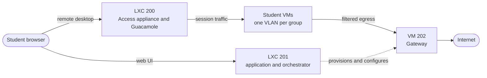

# Architecture

Virtual Lab runs offensive-security exercises on one Proxmox host. Every student
gets their own virtual machines, on their own isolated network, with a filtered
path to the internet and no path to anybody else.

This section explains how that is built. It starts wide and narrows down.

## Where to start

| If you are | Read |
| --- | --- |
| New to the project | [Infrastructure overview](/architecture/infrastructure) |
| A student or instructor asking what a lab VM can reach | [The lab network](/architecture/lab-network) |
| Debugging a connection that is blocked or unexpectedly open | [Where policy is enforced](/architecture/network-policy) |
| Operating, deploying, or extending the orchestrator | [How policy is applied](/architecture/control-plane) |

## The short version

- **One host, three permanent guests.** LXC `201` runs the application and the
  orchestrator, LXC `200` runs Guacamole and brokers remote sessions, VM `202`
  is the routed gateway every student VM sits behind.
- **One VLAN per network group.** A group is one student on one lab profile. It
  gets a VLAN from the pool `2000-2255` and a `/24` derived from that VLAN, so
  the address plan is arithmetic rather than a table somebody maintains.
- **Policy is enforced in three places**, because no single one can see all the
  traffic. Same-segment traffic never reaches a router, so it is filtered on the
  hypervisor; everything routed is filtered on the Gateway; session traffic into
  a VM is filtered on the Access appliance.
- **Nothing is configured by hand.** The database is the desired state, the
  backend renders configuration from it, and an applier installs it over a
  restricted SSH channel that can do nothing else. A timer re-checks every ten
  minutes and repairs what drifted.

## Related sections

- [Setup](/setup) — building the stack for the first time.
- [Operations](/operations) — rebuilding, recovering, and verifying it.
