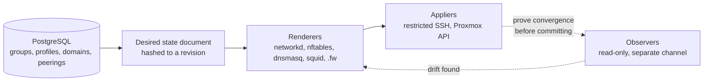
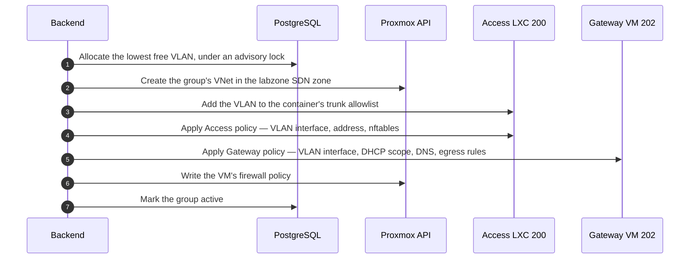
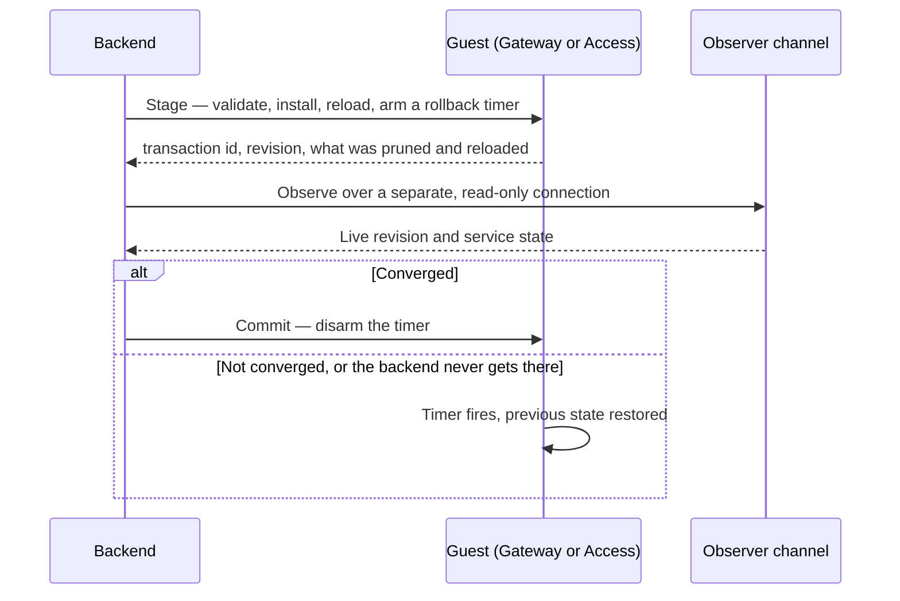

# How policy is applied

No network configuration on this stack is written by hand. The database is the
desired state; the backend renders configuration from it, installs that
configuration over a channel that can do nothing else, and re-checks the result
on a timer.

## Desired state and revisions

The desired state is a JSON document projected from the database — every
operational group, its VLAN, its subnet, its allowed domains, its peerings. That
document is hashed with SHA-256, and the hash is the **revision**.

Revisions do three jobs:

- **An operator can never apply a plan they did not see.** Every apply command
  takes an `--expected-revision`, and the runner refuses if the plan has moved.
  A routine race — two students provisioning at once — is retried a bounded
  number of times rather than failed.
- **Convergence is provable.** The revision is written into the rendered files as
  a comment and into the live nftables table's comment, so an observer can read
  back what is actually running and compare.
- **Renderer changes are not invisible.** The revision hashes the desired-state
  document, not the rendered text — so changing a renderer alone would produce an
  identical revision and a host still running old output would look converged.
  Each renderer therefore carries its own version number, included in the
  document and bumped whenever rendered policy changes meaning.

There are three separate documents, each with its own revision: the
**infrastructure** plan (VNets and trunk membership), the **Gateway** plan, and
the per-VM firewall policy.

## Network modes

A single setting, `settings.network.mode`, decides how much of this is live.

| Mode | Behaviour |
| --- | --- |
| `legacy` | VMs are provisioned on the shared bridge. No VLAN or subnet is allocated, no group is promoted. |
| `dry-run` | Same as legacy for provisioning, but reconciliation can be planned and observed without mutating anything. |
| `active` | Full isolation. Groups are allocated, VNets created, and all four appliers run. |

The shipped default is `legacy`. Flipping to `active` through the API is gated on
the readiness report passing every required check.

## Provisioning a group

When a student launches their first VM on a profile in `active` mode:

The order is the only one that leaves no intermediate state broken:

- The **VNet** must exist before anything can attach to it.
- The **trunk** must carry the VLAN before Access policy creates a subinterface on
  it — otherwise that interface exists while passing no frames, which the Access
  runner refuses outright.
- The **Gateway** goes last on purpose. A VM that boots before its DHCP scope
  exists simply retries and gets an address a moment later; an Access appliance
  without trunk membership is silently broken with nothing to retry.

Each step reconciles the *whole* desired state rather than this one group, so a
run also converges drift left behind by an earlier failure and is a no-op once
everything already matches.

A failure part-way through is deliberately **not** unwound. Every step is
idempotent, the group is marked `error` with its allocation intact, and the next
apply finishes the job. Tearing a VNet or a trunk entry down here could strip
infrastructure a concurrent group depends on.

Teardown runs the same steps in reverse — VNet, Gateway, Access policy, Access
trunk, then release the row — and refuses to delete a VNet that any guest NIC
still references.

## The two-phase apply

Writing a firewall to a machine you reach *through* that firewall is how people
lock themselves out. Every guest apply is therefore staged, verified, and only
then committed.

Staging validates the candidate configuration before installing it — `nft -c`,
`dnsmasq --test`, and so on — then arms a rollback timer on the guest itself.
The default window is five minutes: long enough for an independent observation
over a fresh connection, short enough that a lockout is measured in minutes.

Verification runs over a **different** channel than the change. That is the point
of the design: a broken apply cannot report itself healthy through the connection
it just broke, and committing without independent proof is the one thing this
shape exists to prevent. If the backend crashes between stage and commit, the
guest restores itself.

Staging also **prunes**. A released group's VLAN files are invisible to the
renderer, so removing paths that desired state no longer wants is the only way an
apply converges rather than accumulating.

## The restricted SSH principals

The backend never gets a shell on the Proxmox host. It holds five separate SSH
keys, each pinned to a forced command that accepts one bounded, versioned request
and nothing else.

| Principal | Can |
| --- | --- |
| `access-observer` | Read Access state — read-only |
| `access-applier` | Write Access guest policy |
| `access-trunk-applier` | Change the container's VLAN trunk |
| `gateway-observer` | Read Gateway state — read-only |
| `gateway-applier` | Write Gateway guest policy |

Separate keys mean a capability can be revoked on its own, and an apply can prove
convergence over a different connection than the one that made the change. Each
key must refuse the others' work; that separation is verified rather than assumed
during a rebuild.

The client side is locked down to match: batch mode, strict pinned host-key
checking, one identity, no agent or port forwarding, no local command, no TTY,
bounded output, and connection and execution timeouts.

:::warning The host holds a copy, not a checkout
The forced commands live on the Proxmox host at a fixed path. A change committed
to `infra/access/` or `infra/gateway/` in this repository is **inert** until
`scripts/install-forced-commands.sh` pushes it — and because the renderer in the
application container and the applier on the host are two halves of one contract,
they must be updated together. Redeploy `201` first, then install, then force one
apply.
:::

## The drift reconciler

Every ten minutes the backend re-checks live state against desired state. It runs
only in `active` mode.

It **observes first and repairs only what actually drifted**. An unconditional
apply would be the wrong shape here: a Gateway apply restarts Squid and dnsmasq,
so applying on a schedule would interrupt every student's session in order to
write files that were already correct. Observation is cheap and read-only; repair
is not.

Only *fixable* drift triggers a repair. Checks whose subject is guest
configuration the applier rewrites — the nftables revision, the managed files,
services, sysctl, DNS binding, VLAN interfaces — are repaired. Checks describing
hypervisor state that no amount of file writing corrects — the VM's power state,
trunk topology, whether the uplink is connected, the default route — block
instead, because re-applying against them would fail on a loop and bury the real
problem in noise.

Per-VM firewalls are included for a specific reason: they are rendered from the
group's peering list and its profile's `allow_same_group` flag, both of which an
admin can change long after the VM was provisioned. Nothing else re-applies them,
so without this a new peering would open the Gateway's forward path while every
target VM went on dropping the traffic — an approved pair that half works, which
is the worst of the three states.

Repairs run through the normal runner, take the shared advisory lock, and record
an attempt. A pass that finds the lock held simply skips: whatever holds it is
converging the same desired state anyway.

## Readiness

`GET /network/readiness` grades the whole system and answers one question —
`ready_for_active`. It covers, among others:

| Category | Examples |
| --- | --- |
| Control plane | Exactly one default profile, every template assigned, no planned group holding an allocation, all six executor channels configured |
| Proxmox | The transport bridge exists, the SDN zone exists, VNets match the plan |
| Access | Management address, transport NIC on the trunk bridge, **no** untagged address on the transport NIC, trunk allowlist |
| Gateway | VM status, trunk topology, uplink connected, default route, management address, VLAN interfaces, nftables revision, managed files, services, sysctl, DNS binding |
| Enforcement | The datacenter firewall is on, and node rules admit the orchestrator |
| Runtime facts | The Gateway's interface names and upstream resolvers have been recorded |

That last row cannot be derived from the database — interface names are a
property of the guest — so an unrecorded Gateway is a required failure rather
than a guess. They are set with `npm run set-gateway-settings`.

## Operator commands

Rendering is always safe; it only prints what *would* be installed.

| Command | Does |
| --- | --- |
| `npm run render-gateway` | Print the rendered Gateway configuration and its revision |
| `npm run render-access` | Print the rendered Access configuration and its revision |
| `npm run apply-gateway-policy` | Stage, verify, commit Gateway policy |
| `npm run apply-access-trunk` | Reconcile the Access container's trunk membership |
| `npm run apply-access-policy` | Stage, verify, commit Access policy |
| `npm run apply-network-vnets` | Reconcile Proxmox SDN VNets |
| `npm run release-network-group` | Tear a group down and return its VLAN to the pool |
| `npm run set-gateway-settings` | Record the Gateway's interface names and resolvers |
| `npm run preflight-network-tokens` | Check the Proxmox API tokens have the privileges they need |

Every applier requires `--requested-by`, `--expected-revision`, and an explicit
confirmation phrase. Attempts are recorded in the database with their checks,
actions, and outcome, so there is an audit trail for every mutation.

## Next

- [Production rebuild](/operations/production-rebuild) — the full procedure,
  including the order these pieces must be brought up in and the isolation matrix
  that verifies the result.
- [Where policy is enforced](/architecture/network-policy) — what the applied
  configuration actually does.
