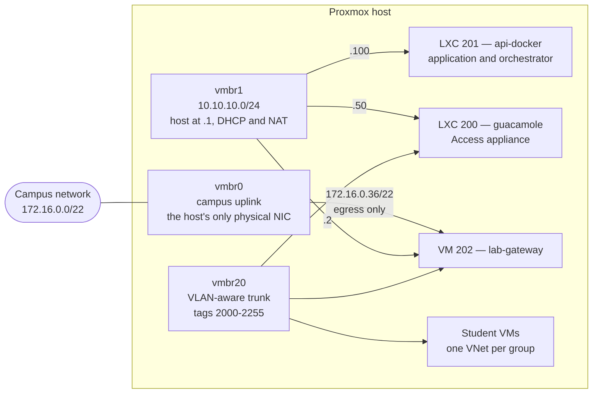
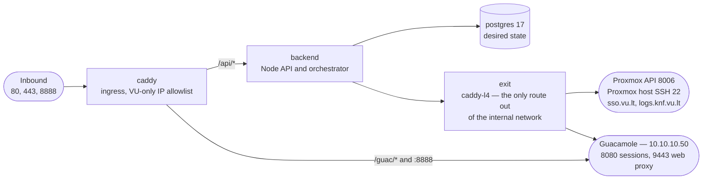
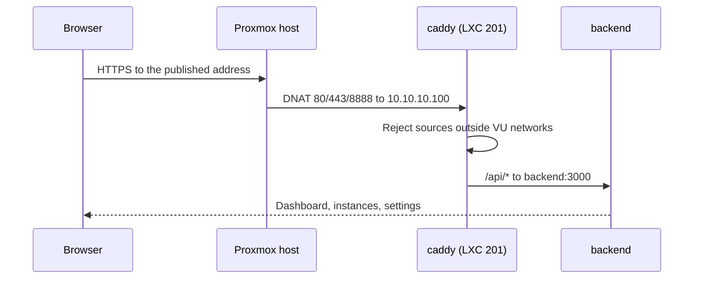
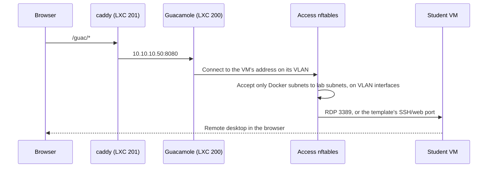
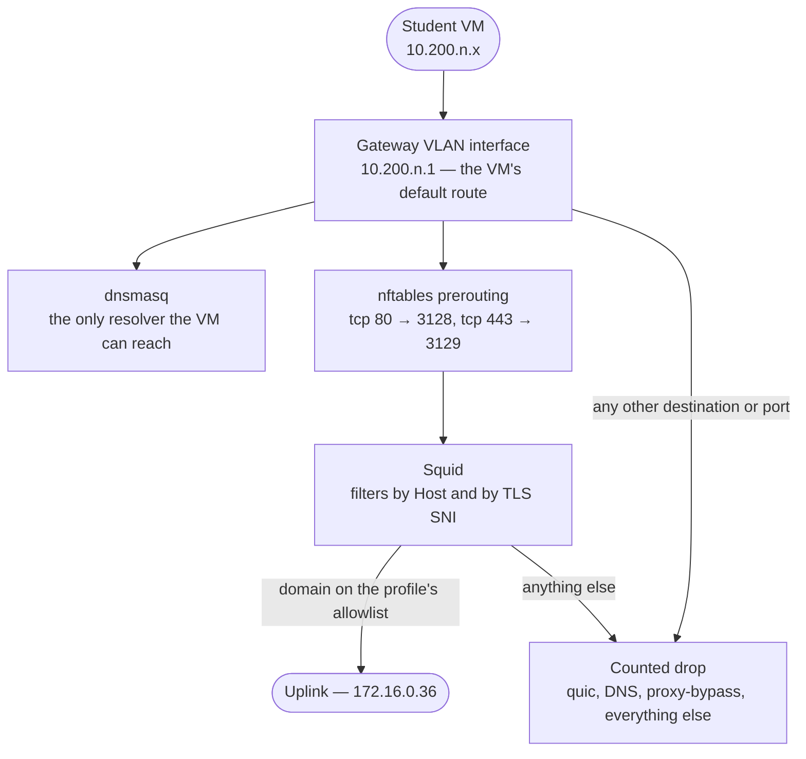

# Infrastructure overview

Everything runs on a single Proxmox VE host. The host provides three bridges and
hosts three permanent guests; everything else — student VMs, their VLANs, their
subnets — is created and destroyed on demand.

Addresses below are the real ones. Production is `172.16.0.122`, development is
`172.16.0.34`; both sit on the same campus segment.

## The whole picture

The trunk bridge carries no untagged lab traffic in the current design: both
appliances reach a group only through a VLAN subinterface — `eth1.2000`,
`eth1.2001` and so on inside LXC `200`, `ens19.2000` and up inside VM `202`. That
is what keeps a group's segment a segment rather than one flat shared network.

## The three bridges

| Bridge | Carries | Addressing |
| --- | --- | --- |
| `vmbr0` | Campus network and Proxmox management | The host's own campus address; the Gateway's egress uplink at `172.16.0.36/22` via `172.16.0.1` |
| `vmbr1` | Infrastructure management between the host and its guests | `10.10.10.0/24`, host at `.1`, DHCP pool `.120-.199` |
| `vmbr20` | Lab transport, VLAN-filtered for tags `2000-2255` | No lab addresses on the untagged segment; every group lives on its own tagged VLAN |

Proxmox owns the bridges themselves, in `/etc/network/interfaces`. It has to:
PVE does not read network configuration from sourced files, so a bridge defined
under `interfaces.d` would be invisible to the Proxmox API and to the backend's
readiness checks.

Everything layered on top of the bridges — DHCP, NAT, forwarding, the sysctl
settings — is reconciled by `scripts/setup-proxmox-host-network.sh`, which is a
dry run by default and refuses to overwrite a file whose contents have changed
without an explicit flag.

:::note The uplink shares a segment with Proxmox management
The host has one physical NIC, and a second adapter added during testing was
proven by packet capture to land on the same segment — so a separate bridge would
have bought no isolation. This is a recorded, accepted deviation. The Gateway's
firewall therefore exposes **no service** on that NIC beyond DHCP client replies.
:::

## The three permanent guests

| VMID | Name | Role | CPU / RAM / disk | Addresses |
| --- | --- | --- | --- | --- |
| `200` | `guacamole` | Access appliance — brokers remote sessions into student VMs | 4 / 10 GB / 32 GB | `10.10.10.50` on `vmbr1`; VLAN subinterfaces on `vmbr20` |
| `201` | `api-docker` | Application and orchestrator | 4 / 6 GB / 32 GB | `10.10.10.100` on `vmbr1` |
| `202` | `lab-gateway` | Routed gateway, DHCP, DNS, and web filtering for every lab VLAN | 2 / 4 GB / 16 GB | `10.10.10.2` management, VLAN trunk, `172.16.0.36/22` uplink |

All three are declared in `infra/opentofu/lab`, along with the Ubuntu template,
the pinned Gateway cloud image, and the `labzone` VLAN SDN zone. That OpenTofu
root deliberately creates **no** VNets — those belong to the backend, because
they come and go with student groups.

LXC `200` wears two hats. It runs Guacamole, and it is also the *Access
appliance*: the thing that holds a foot in every group's VLAN so a browser
session can reach a VM that is otherwise unreachable. Most of the documentation
calls it "Access" when talking about the network and "Guacamole" when talking
about sessions; it is one container either way.

## Inside LXC 201 — the application stack

One Docker Compose stack. The API and the database sit on an internal-only
Docker network with no route out at all; a single egress proxy is their only way
off it.

`exit` is a layer-4 proxy with a fixed set of destinations — the Proxmox API, the
Proxmox host's SSH port, Guacamole, and two named VU services matched by TLS SNI.
Anything the backend wants to reach that is not on that list simply has no path.
Log shipping runs as an optional Fluent Bit sidecar that reads Caddy's log files
from a shared volume rather than over the network.

## Three journeys

### A student opens the web UI

The host-level forwarding is optional and explicit: it exists only when
`setup-proxmox-host-network.sh` was run with `--forward-app-ports`.

### A student opens a VM session

The VM's own Proxmox firewall admits that connection **only** from the Access
address (`.2` on its subnet) and **only** on the port its template actually uses.
Nothing else on the segment can open that port.

### A student VM reaches the internet

Squid never decrypts anything. It peeks at the TLS handshake to read the server
name, splices the connection through untouched when that name is on the group's
allowlist, and terminates it otherwise — so no certificate has to be installed on
a lab VM.

## Who owns what

A recurring source of confusion is that four different mechanisms configure this
host. They do not overlap.

| What | Owned by | Changed how |
| --- | --- | --- |
| The bridges `vmbr0`, `vmbr1`, `vmbr20` | Proxmox, in `/etc/network/interfaces` | By hand, through the Proxmox API |
| Host DHCP, NAT, forwarding, sysctl | `scripts/setup-proxmox-host-network.sh` | Re-run the script |
| Template, LXC `200`/`201`, VM `202`, the `labzone` SDN zone | `infra/opentofu/lab` | `tofu plan` then `tofu apply` |
| Lab VNets, Gateway and Access guest configuration, per-VM firewalls | The backend, from the database | Automatically, on provisioning and on a timer |
| The forced commands the backend drives the host through | `scripts/install-forced-commands.sh` | Re-run after any change under `infra/access/` or `infra/gateway/` |

The last row catches people out. The Proxmox host holds a *copy* of those
scripts, not a checkout, so a change committed to this repository is inert until
it is installed — and a stale copy fails in ways that look like network faults
rather than version skew.

## Next

- [The lab network](/architecture/lab-network) — how a student's VLAN and subnet
  are chosen, and what a VM on it can reach.
- [Where policy is enforced](/architecture/network-policy) — the three
  enforcement planes and why there have to be three.
