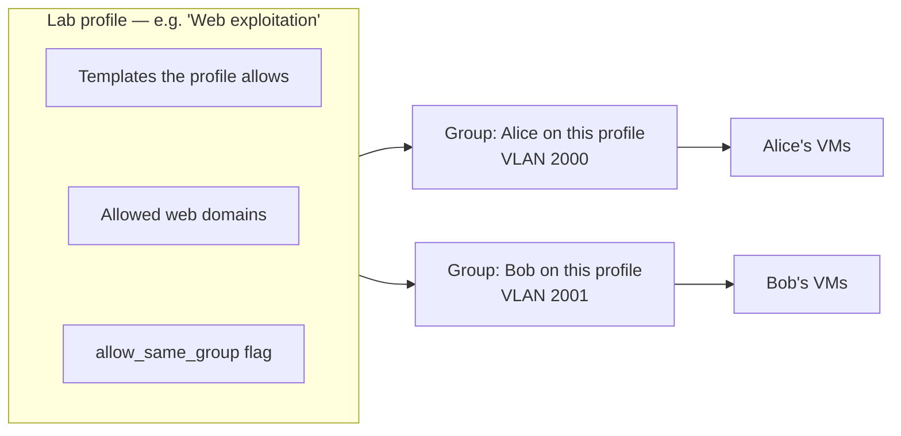
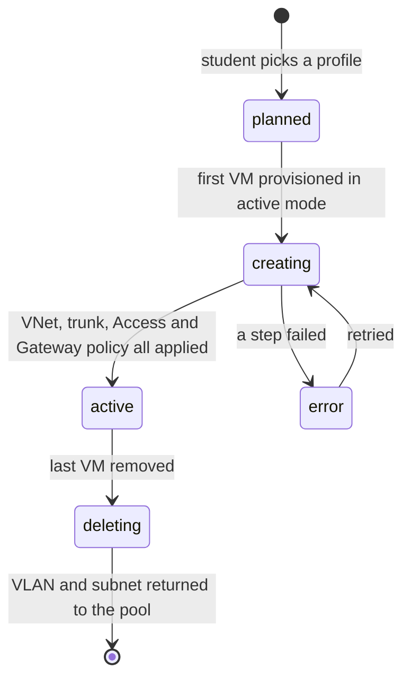
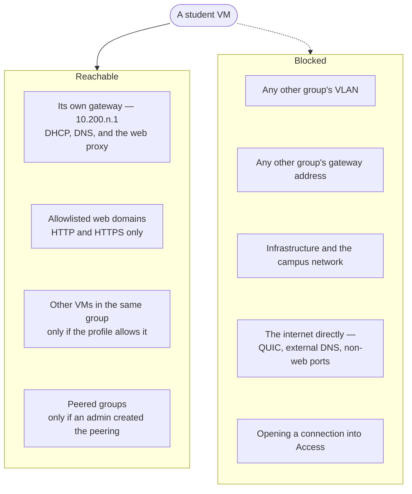

# The lab network

Every student VM lives on a private, isolated network of its own. This page
explains how that network is chosen and what sits on it. It is the page to read
before asking "why can my VM not reach X".

## Network groups

The unit of isolation is a **network group**: one owner on one lab profile.

Two consequences fall straight out of that definition:

- One account **cannot** have two groups on the same profile. Every VM a student
  launches from a given profile lands in the same group, on the same VLAN.
- Two students on the same profile are always in **different** groups, so they
  are isolated from each other by default no matter what the profile says.

## How a VLAN and subnet are chosen

A group is allocated the lowest free VLAN in the pool `2000-2255` — 256 groups
maximum. Everything else is derived from that number rather than stored
independently:

| Derived from VLAN `T` | Value | Example, `T = 2007` |
| --- | --- | --- |
| VNet name | `lab<T>` | `lab2007` |
| Subnet | `10.200.<T − 2000>.0/24` | `10.200.7.0/24` |
| Gateway address | host `.1` | `10.200.7.1` |
| Access address | host `.2` | `10.200.7.2` |
| DHCP pool | hosts `.25` to `.254` | `10.200.7.25 - 10.200.7.254` |

The whole lab therefore occupies `10.200.0.0/16`, split into 256 `/24` networks.

Deriving rather than storing is deliberate. Allocation is written inside a
transaction that takes an advisory lock and re-reads the occupied VLANs, and the
persisted VNet name and subnet are checked against the derived ones on every
read — so a row that disagrees with the arithmetic is rejected as corrupt rather
than quietly used.

## Group lifecycle

A `planned` group holds no VLAN and no subnet — it is just a row saying which
profile a student intends to use. Allocation happens on the first VM, and only
in `active` [network mode](/architecture/control-plane#network-modes).

A group in `error` **keeps** its allocation. Releasing the VLAN there could hand
the subnet to another student while Proxmox resources from the failed attempt
still reference it. Retrying resumes; nothing has to be repaired by hand.

Teardown runs in the reverse order of provisioning and refuses to release a VLAN
while any guest NIC still names its VNet. Once released, the VLAN goes back into
the pool and the next group to be allocated will reuse it.

## What a VM can reach

In table form, with the reason:

| From a lab VM to | Result | Why |
| --- | --- | --- |
| Its own gateway, DHCP and DNS | Works | dnsmasq serves each VLAN on that VLAN's own address |
| An allowlisted domain, HTTP or HTTPS | Works | Transparently redirected to Squid, which matches the name against the profile's allowlist |
| A domain not on the allowlist | `403`, or the TLS connection is terminated | Squid splices only allowlisted names and terminates the rest |
| Anything on UDP 443 (QUIC) | Dropped, counted as `quic-denied` | QUIC would bypass the proxy entirely |
| An external DNS resolver | Dropped, counted as `external-dns-denied` | The gateway's resolver is the only one reachable |
| Any other port to the internet | Dropped, counted as `lab-egress-denied` | Only proxied web traffic leaves |
| Another VM in the same group | Depends on the profile's `allow_same_group` | Enforced on the hypervisor, not the gateway |
| Another group, unpeered | Dropped, counted as `cross-group-denied` | The gateway forwards only explicitly peered pairs |
| Another group's gateway address | Dropped | Each VLAN's input rules are scoped to that VLAN's own address, so a VM cannot even enumerate which other groups exist |
| Proxmox management or the campus segment | Dropped | Those ranges are excluded from proxying and dropped in the forward chain |
| Sourcing from an address outside its own `/24` | Dropped | The per-VM IP filter allows only the group's subnet, minus `.1` and `.2` |
| Answering DHCP | Dropped | A lab VM must never act as a DHCP server for its neighbours |

And inbound, towards a VM:

| To a lab VM from | Result |
| --- | --- |
| The Access appliance, on the template's session port | Allowed — this is how remote desktop works |
| The Access appliance, on any other port | Dropped |
| The Gateway, ICMP | Allowed, for diagnostics and path-MTU discovery |
| The Gateway, any TCP port | Dropped |
| Anything else | Dropped — ingress policy is default-deny |

## The three knobs an admin actually turns

Everything above is fixed by design. Three things are policy decisions, and all
three live in the database rather than in any configuration file.

### `allow_same_group`, per lab profile

Whether a student's own VMs can talk to each other. Set on the profile, so a
"build a network and attack it" profile can enable it while a "each box is an
island" profile does not. It is on by default.

Because a group is one owner on one profile, this is never two students reaching
each other — only one student's own machines.

### Allowed web domains, per lab profile

A list of hostnames. Each entry can include subdomains or not. A profile with an
empty list has no web access at all; nothing falls through to another profile's
allowlist.

Entries are hostnames, not URLs and not patterns — no scheme, no port, no path,
no wildcards. Subdomain matching is the `include_subdomains` flag, not a `*`.

### Group peerings, between two groups

An explicit, undirected link between two groups, created by an admin. Peered
traffic is **routed** by the gateway rather than proxied, and both groups' VMs
must also admit each other's subnet — which they do, because the per-VM firewall
is rendered from the same peering list.

Removing a peering closes existing connections, not just new ones: the gateway
evaluates the current peering list *before* it readmits established flows,
precisely so a deleted peering does not leave an open session running.

:::note Changes converge, they do not apply instantly
Toggling `allow_same_group`, or editing a peering, becomes real on the next
apply. Provisioning triggers one; otherwise the drift reconciler picks it up
within ten minutes. Allow a full pass before concluding a change did not work.
:::

## Next

- [Where policy is enforced](/architecture/network-policy) — the three planes
  behind the table above.
- [How policy is applied](/architecture/control-plane) — how a database change
  becomes a live rule.
