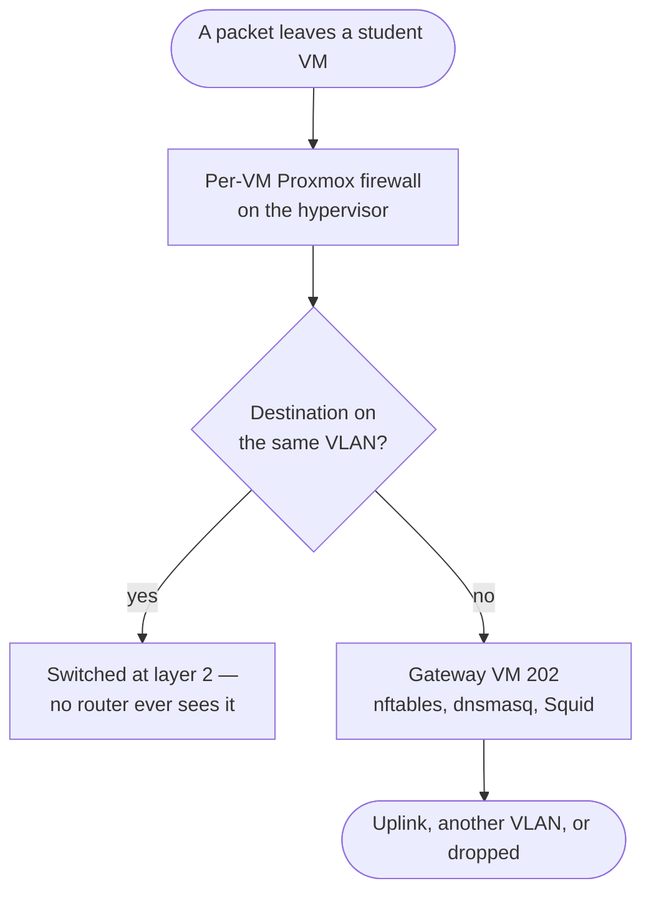

# Where policy is enforced

Network policy is enforced in three separate places. That is not redundancy: each
plane sees traffic the other two structurally cannot.

## Why three

Two VMs on the same VLAN talk to each other through a layer-2 switch. Their
packets never reach a router, so the Gateway's ruleset — where every other
control lives — never sees them. Conversely, the hypervisor firewall sees every
packet a VM sends but knows nothing about domain names or TLS handshakes.

| Traffic | Seen by |
| --- | --- |
| VM to VM on the same VLAN | Per-VM firewall only |
| VM to another group's VLAN | Gateway forward chain, then the target VM's own firewall |
| VM to the internet | Gateway — nftables, then dnsmasq or Squid |
| Guacamole to a VM | Access nftables, then the target VM's firewall |

## Plane 1 — the Gateway (VM 202)

The Gateway is the default route for every lab VLAN. It holds one VLAN
subinterface per active group and runs three services, all of them rendered from
the database and none of them edited by hand.

### nftables

One table, `inet virtual_lab_gateway`, with a drop policy on both `input` and
`forward`.

**Input** — what the Gateway itself will answer:

- Every lab-facing rule is scoped to *that interface's own address*, using a
  concatenated `interface . address` set. A plain interface match would let a VM
  on one VLAN reach the Gateway on every other VLAN's address and enumerate the
  groups that exist. The boundary does not leak its own shape.
- The exception is DHCP discovery, which is broadcast to `255.255.255.255` and
  carries nobody's interface address. It is admitted separately; dnsmasq binds
  per interface, so a broadcast on one VLAN is still only answered from that
  VLAN's scope.
- On the management NIC: SSH and ICMP, from `10.10.10.1` and `10.10.10.100` only.
- On the uplink: nothing but DHCP client replies. That NIC shares a segment with
  Proxmox management, so the Gateway offers no service there at all.

**NAT prerouting** — where web traffic is captured:

| Match | Action |
| --- | --- |
| Lab interface, destination is another lab subnet | `return` — peered traffic is routed, never proxied |
| Lab interface, destination is private or infrastructure space | `return` — falls through to the forward chain, where it is counted and dropped |
| Lab interface, TCP 80 | Redirect to Squid on `3128` |
| Lab interface, TCP 443 | Redirect to Squid on `3129` |

That second row matters more than it looks. `prerouting` runs before the routing
decision, so a redirected packet is delivered locally and never traverses the
forward chain — without the exclusion, lab traffic aimed at management on port 80
would be handed to Squid, which would then reach infrastructure the forward
drops exist to protect.

**Forward** — what the Gateway will route:

1. Peered lab-to-lab pairs are accepted, matched against the *current* peering
   set. This is evaluated **before** the blanket `established,related` accept, so
   deleting a peering also kills the sessions it was carrying. An undirected
   peering renders both interface-direction tuples, so replies match in their own
   right rather than relying on connection tracking.
2. Everything else lab-to-lab is dropped, counted as `cross-group-denied`.
3. `established,related` is accepted.
4. The forbidden egress classes are dropped with named counters, so a report can
   say *which* rule refused a connection:

   | Counter | Drops |
   | --- | --- |
   | `quic-denied` | UDP 443 towards the uplink |
   | `proxy-bypass-denied` | TCP 80 and 443 that somehow reached the forward chain |
   | `external-dns-denied` | UDP 53, TCP 53 and 853 |
   | `lab-egress-denied` | Anything else towards the uplink |
   | `cross-group-denied` | Anything else from a lab interface at all |

There is no source-NAT chain, by design. Approved egress is emitted by Squid and
the local resolver, which are locally generated and already leave with the
uplink's address. Forwarded lab traffic never reaches the uplink, so a masquerade
rule could only ever widen policy.

### dnsmasq

DHCP and DNS for the lab VLANs, and only for the lab VLANs. Each group gets a
scope covering `.25` to `.254` of its own `/24`, handing out its own gateway
address as both router and resolver.

It binds with an explicit interface allowlist plus explicit exceptions for the
uplink and management NICs — so even with zero groups allocated, it binds
loopback rather than falling back to every interface. Putting a DHCP server on
the campus segment by accident is not a mistake that can be made here.

### Squid

Squid enforces the per-profile domain allowlist. Traffic arrives intercepted, so
lab VMs are not configured with a proxy and cannot be reconfigured to skip one.

- **HTTP** is matched on the request's domain, with reverse DNS lookups disabled.
  Without that, Squid would PTR-resolve a raw-IP destination and match the
  allowlist against an answer the destination's owner controls.
- **HTTPS** is matched on the TLS server name, read by peeking at the
  ClientHello. A connection whose name is on the group's allowlist is **spliced**
  — tunnelled through untouched, with the Gateway holding no key and seeing no
  plaintext. Everything else is terminated before a single byte reaches the
  origin, including connections carrying no server name at all.
- Every ACL is scoped to the group's own source subnet, so one group's allowlist
  can never splice another group's connection. A group with an empty allowlist is
  denied explicitly rather than falling through.
- `host_verify_strict` is on: an intercepted request is checked against the
  address the client actually connected to, so an allowlisted `Host` header
  cannot be used to reach an arbitrary server.
- Nothing is cached, and the Gateway advertises neither itself nor the
  originating client upstream.

## Plane 2 — the Access appliance (LXC 200)

Access holds a VLAN subinterface in every active group so Guacamole can reach the
VMs. Its ruleset exists to make sure that is the *only* thing that path can be
used for.

One table, `inet virtual_lab_access`, forward policy drop:

| Rule | Purpose |
| --- | --- |
| `established,related` accept | Replies to sessions Access itself opened |
| Docker bridge subnets to lab subnets, out VLAN interfaces only | The Guacamole container reaching a VM |
| Published services `8080` and `9443` on `10.10.10.50`, from `10.10.10.100` only | The application stack reaching Guacamole |
| Everything else | Dropped by policy |

That drop policy is what denies lab-to-lab traffic, lab-to-management traffic,
and any attempt to use Access as a router between groups.

:::note Why the ruleset is loaded as a standalone file
The Access ruleset begins by creating and deleting its own table, which makes
loading that one file idempotent. That matters: `/etc/nftables.conf` opens with
`flush ruleset`, which would destroy every table in the namespace — including the
`ip nat` table holding Docker's masquerade rules. Without those, Guacamole would
reach student VMs as a Docker-internal address instead of the appliance's VLAN
address, and every per-VM firewall would drop it.
:::

## Plane 3 — the per-VM Proxmox firewall

This is the only place same-segment policy *can* be enforced, so student-to-student
isolation, rogue-DHCP suppression, and source-address spoofing are handled here or
nowhere.

Each VM gets its own rendered policy:

- **Ingress is default-deny.** Egress stays default-allow, because the Gateway is
  the single source of truth for what a VM may reach off-segment; duplicating that
  here would create two policies that drift.
- **IP filtering** against an address set containing the group's subnet, with the
  gateway and Access addresses explicitly excluded. A VM that could source from
  `.2` could open a session to a neighbour's remote-desktop port, which is exactly
  the isolation this plane exists to provide.
- **MAC filtering** on, **IPv6 neighbour discovery and router advertisements** off,
  so IPv6 cannot establish on the segment and become an unfiltered bypass.

Ingress rules, in the order Proxmox evaluates them — first match wins:

| # | Match | Action | Present when |
| --- | --- | --- | --- |
| 1 | Access address, on the template's session ports | ACCEPT | Always |
| 2 | Gateway address, ICMP | ACCEPT | Always |
| 3 | Access address, ICMP | ACCEPT | Always |
| 4 | Gateway address, the DHCP reply | ACCEPT | `allow_same_group` |
| 5 | Gateway address, anything else | DROP | `allow_same_group` |
| 6 | Access address, anything else | DROP | `allow_same_group` |
| 7 | The group's own subnet, any port and protocol | ACCEPT | `allow_same_group` |
| 8 | Each peered group's subnet | ACCEPT | When a peering exists |
| — | Everything else | DROP, by policy | Always |

Rules 5 and 6 are load-bearing. The gateway and Access addresses live *inside*
the group's subnet, so without those two drops the broad accept at step 7 would
silently widen Access from its session ports to every port, and the Gateway from
ICMP to every protocol. They only work above it, and nothing else in the list is
an ingress drop — there is no second line of defence.

Rule 4 sits above them for the same reason in reverse: a drop from the gateway
address would otherwise stop every VM renewing its DHCP lease.

Egress carries three drops the Gateway structurally cannot enforce, because that
traffic never reaches it:

| Rule | Stops |
| --- | --- |
| UDP destination port 68 | A lab VM answering DHCP |
| UDP source port 67 | A lab VM relaying DHCP |
| Anything to the Access address | A VM opening a connection *into* Access; replies to Access-initiated sessions are unaffected |

Session ports are derived from the template rather than assumed — RDP for a
Guacamole template, or the configured SSH or web port. Guessing a superset would
widen the one ingress a student VM has.

:::danger These rules are inert unless the datacenter firewall is enabled
With the Proxmox datacenter firewall off, every `.fw` file still reads as
correct and every apply still converges — while student VMs on one VLAN can reach
each other freely. Readiness grades this explicitly as `vm-firewall-enforcement`.

Enabling it also requires node rules admitting the orchestrator on TCP `8006` and
`22`. Proxmox's automatic management allowances are scoped to the host's own
management network, and the orchestrator arrives from elsewhere — so enabling the
firewall without those rules leaves every guest reachable and the control plane
dark. That is graded by the same check.
:::

## Next

- [How policy is applied](/architecture/control-plane) — how these rulesets get
  written and kept correct.
- [Production rebuild](/operations/production-rebuild) — the isolation matrix
  that verifies all of the above on a real host.
