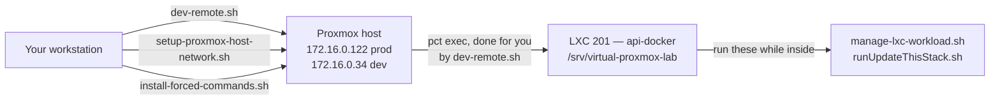

# Operator scripts

The repository ships a small set of operator scripts. The single most common
mistake is running one in the wrong place, so start with that.

## Where each one runs



| Script | Run it from | How it reaches the target |
| --- | --- | --- |
| `scripts/dev-remote.sh` | Workstation | SSH to the host, then `pct exec` into the API LXC |
| `scripts/setup-proxmox-host-network.sh` | Workstation | SSH to the host |
| `scripts/install-forced-commands.sh` | Workstation | SSH to the host |
| `scripts/manage-lxc-workload.sh` | Inside the LXC, as root | Local `git` and Docker |
| `./runUpdateThisStack.sh` | Inside LXC `201` | Local `git` and Docker |

## `dev-remote.sh` — the remote entry point

Every subcommand is one reviewable remote action, so access can be granted
narrowly instead of handing out arbitrary remote shell. Prefer this over
hand-written `ssh` and `pct exec` lines.

Despite the name it drives production too — the target is an environment
variable, not a hardcoded address:

```bash
# Development (the default)
./scripts/dev-remote.sh status

# Production
DEV_REMOTE_HOST=172.16.0.122 ./scripts/dev-remote.sh status
```

| Override | Default | Meaning |
| --- | --- | --- |
| `DEV_REMOTE_HOST` | `172.16.0.34` | Proxmox host to reach |
| `DEV_REMOTE_CTID` | `201` | API LXC id |
| `DEV_REMOTE_INSTALL_ROOT` | `/srv/virtual-proxmox-lab` | Checkout path inside the LXC |

Read-only commands, safe to run any time:

| Command | Prints |
| --- | --- |
| `status` | Compose service state and the deployed image tags |
| `readiness` | The authenticated readiness report, failing checks only |
| `settings` | Persisted `metadata` keys and values |
| `groups` | Network groups and their VLAN/subnet allocations |
| `vnets` | Proxmox SDN VNets and zones |
| `attempt-status` | The newest reconciliation attempt |
| `attempt-detail` | That attempt's revision, planned actions, and checks |
| `preflight-tokens` | The Proxmox network token lifecycle preflight |

Mutating commands:

| Command | Does |
| --- | --- |
| `configure-gateway <mgmt> <trunk> <uplink> <resolvers>` | Records the Gateway's interface names and upstream resolvers |
| `deploy` | Runs `runUpdateThisStack.sh --allow-dirty` inside the LXC |

No command prints secrets, `.env` contents, or token values.

:::danger `deploy` is a development command
`dev-remote.sh deploy` passes `--allow-dirty`, which builds a uniquely tagged
**rehearsal** image and explicitly tolerates an uncommitted checkout. The project
README says never to use that option for a production deployment.

It also does **not** pull. It deploys whatever the checkout already contains, so
a freshly pushed commit will not be picked up.

A real production deploy is a pull followed by the unflagged script:

```bash
pct exec 201 -- sh -lc 'cd /srv/virtual-proxmox-lab && git pull'
pct exec 201 -- sh -lc 'cd /srv/virtual-proxmox-lab && ./runUpdateThisStack.sh'
```
:::

The image tags reported by `status` are the first twelve characters of the
deployed Git SHA, which is how you tell what a host is actually running:

```text
virtual-lab-backend  running virtual-lab-backend:18e5a5a6ac4b
virtual-lab-endpoint running virtual-lab-endpoint:18e5a5a6ac4b
```

## `runUpdateThisStack.sh` — the production deploy

Runs inside LXC `201`, from the checkout root. It refuses to deploy an unclean
revision, then in order:

1. Validates the Compose model for the resolved Git SHA.
2. Starts PostgreSQL if needed and writes a compressed backup under
   `_DATA/deployment-backups`.
3. Builds `virtual-lab-backend` and `virtual-lab-endpoint`, tagged with the SHA.
4. Applies `backend/schema.sql` in one transaction.
5. Waits for Compose health checks.
6. Runs an authenticated read-only reconciliation smoke test, using the first
   configured admin account.

It updates services in place; it does not stop the stack first. If application
startup fails, the previous backend and endpoint image IDs are restored
automatically. **Database changes are not reversed** — the backup path is printed,
so restore it after diagnosing the failed revision.

:::note This is also how documentation ships
There is no separate docs service. `endpoint/Dockerfile` builds `docs/` in its
own stage and copies the output into the endpoint image at `/srv/docs`, the same
way it builds `vite/` into `/srv/frontend`. Publishing a documentation change
therefore means a full deploy — there is no lighter path.
:::

:::caution One-time step when upgrading across the service rename
Services and containers were renamed to `virtual-lab-*`. Compose treats the
old containers as orphans, so `caddy` keeps holding 80, 443 and 8888 and the new
`virtual-lab-endpoint` cannot bind them. Take the stack down once before the
first deploy on this revision:

```bash
docker compose down --remove-orphans
```

The database lives in `_DATA/postgres` and survives that. The deployed `.env`
needs no edit: the exit container keeps the alias `exit`, so `PROXMOX_BASE_URL`,
`GUACAMOLE_URL` and the five `*_HOST` settings keep resolving.
:::

`--allow-dirty` exists only for a disposable development environment carrying
operator overlays. It performs the same backup, schema, health, smoke-test and
rollback workflow, but tags a uniquely named rehearsal image.

## `manage-lxc-workload.sh` — LXC lifecycle

Runs **inside** the container, as root. It asserts that `hostname -s` matches
`--role`, so it cannot be pointed at the wrong guest by accident.

```bash
sudo ./scripts/manage-lxc-workload.sh update --role api-docker
sudo ./scripts/manage-lxc-workload.sh status --role api-docker
```

| Action | Does |
| --- | --- |
| `install` | Installs Docker, clones `--repository` at `--ref`, prepares runtime, starts Compose |
| `update` | Refuses a dirty checkout, fetches, `pull --ff-only`, then rebuilds and restarts Compose |
| `status` | `docker compose ps` for the role |

Roles are `api-docker` (the application stack) and `guacamole` (its own Compose
file under `infra/guacamole/`). Options are `--repository`, `--ref` (default
`main`), and `--install-root` (default `/srv/virtual-proxmox-lab`).

`update` rebuilds images through Compose. It does **not** take a database backup,
apply `schema.sql`, or run the smoke test — use `runUpdateThisStack.sh` for a
production application deploy.

For `api-docker`, `install` stops after checkout when `.env` is absent. Create
that file first; the runtime preparation step also creates the external Docker
network and the `_DATA` and `_LOGS` directories the Compose model expects.

## `setup-proxmox-host-network.sh` — host networking

Reconciles the host's DHCP, NAT, forwarding, and sysctl settings. Run from the
workstation; it is a **dry run by default**.

```bash
./scripts/setup-proxmox-host-network.sh --host 172.16.0.122 --dry-run

./scripts/setup-proxmox-host-network.sh \
  --host 172.16.0.122 \
  --apply \
  --confirmation 'APPLY NETWORK 172.16.0.122 vmbr1 vmbr20'
```

The confirmation phrase carries the target host, so a phrase copied from a
previous run cannot be replayed against a different box.

It does **not** create bridges. Proxmox owns `vmbr1` and `vmbr20` in
`/etc/network/interfaces`, because PVE does not read its network configuration
from sourced files; the script only verifies they exist and are VLAN-filtered. It
reloads no interface, so it is safe to run while guests are attached.

| Option | Effect |
| --- | --- |
| `--forward-app-ports` | Forwards TCP `80`, `443`, `8888` and UDP `443` to `10.10.10.100` |
| `--replace-drifted-files` | Replaces a managed file whose contents changed; requires `--apply` |
| `--interactive-auth` | Permits SSH password prompts |

When a managed file has drifted it prints a unified diff and refuses. Review the
diff, then re-run with `--replace-drifted-files`. It never touches an unmarked
file. Repeat whichever ingress mode was used previously — omitting
`--forward-app-ports` removes those forwarding rules.

## `install-forced-commands.sh` — the control-plane contract

Installs the nine root-owned forced commands from `infra/access/` and
`infra/gateway/` onto the Proxmox host, then verifies with `sha256sum` that what
landed matches the checkout byte for byte.

```bash
./scripts/install-forced-commands.sh --host 172.16.0.122 --dry-run
./scripts/install-forced-commands.sh --host 172.16.0.122 --apply
```

Dry run is the default and reports drift as `matching`, `drifted`, or `missing`
per file. No confirmation phrase is needed — it only writes the current
checkout's contents, and re-running is idempotent.

:::warning Run this after any change to those files
The host holds a *copy*, not a checkout, so a committed change is inert until it
is installed. The renderer in the application container and the applier on the
host are two halves of one contract and must move together: redeploy `201` first,
then install, then force one apply. A stale copy fails in ways that look like
network faults rather than version skew.
:::

## Related

- [Production rebuild](/operations/production-rebuild) — the full bare-metal
  procedure these scripts fit into.
- [How policy is applied](/architecture/control-plane#operator-commands) — the
  backend CLI for rendering and applying network policy.
- `infra/prod-migration/` — the backup and inventory scripts listed on the
  [Operations](/operations) page.
